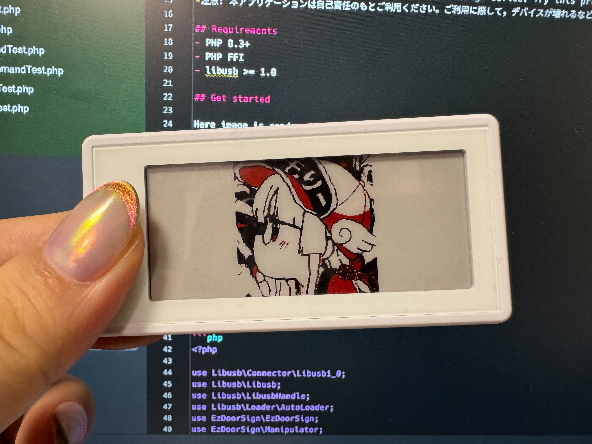

# EZ Door Sign on PHP
## What is this?

This project is available to work the EZ Door Sign on PHP under any OS.
The EZ Door Sign is mini-sized electric paper display (EPD). It is better used for IoT tool.

- EZ Door Sign: https://www.santekshop.com/pages/santek-2-9-ez-door-sign

You can use RaspberryPI and macOS and more various environment.
For example, this project is available to render an image automatically. Therefore, this project can be used in a variety of situations.

## Notice
Santek Inc. has requested that users of this application use it at their own discretion.
The developer assumes no responsibility for any disadvantages that may result from the use of this application, such as device breakage, so please use at your own risk.

本アプリケーションのご利用については EZ Door Sign 発売元の株式会社サンテクノロジー（Santek Japan Corporation）社より，本アプリケーションをご利用になられるユーザーの皆様には自身のご判断にて ご利用いただく旨を記載するようお願いを受けております。
あわせて，開発者側としましても本アプリケーションをご利用になられるにあたり，デバイスが壊れるなど何かしら不利益を被った場合においても何ら責任は負いませんので，自己責任のもとご利用ください。


## Requirements
- PHP 8.3+
- PHP FFI
- libusb >= 1.0

## Get started

Here image is rendered by this PHP code project.




1. Install this project via composer:
```
$ composer require m3m0r7/ez-door-sign
```

2. Connect your EZ door sign device into your machine.
3. Turn on your device.

### Quick start

#### Refresh the device

```php
<?php

use Libusb\Connector\Libusb1_0;
use Libusb\Libusb;
use Libusb\LibusbHandle;
use Libusb\Loader\AutoLoader;
use EzDoorSign\EzDoorSign;
use EzDoorSign\Manipulator;

require __DIR__ . '/vendor/autoload.php';

$libusb = new Libusb(
    new LibusbHandle(
        new Libusb1_0(
            new AutoLoader(
                '1.0',
                // Specify loading path libusb
                is_dir('/opt/homebrew/Cellar/libusb')
                    ? glob('/opt/homebrew/Cellar/libusb/1.0.*') ?: []
                    : []
            ),
        )
    ),
);

$ezDoorSign = new EzDoorSign($libusb);

/**
 * @var Manipulator $manipulator
 */
[$manipulator] = $ezDoorSign->devices();

// Run refresh command
$manipulator->refresh();

```

#### Render a text/image


```php
<?php

use EzDoorSign\Command\renderImageCommand;
use EzDoorSign\EzDoorSign;
use EzDoorSign\Manipulator;
use Libusb\Connector\Libusb1_0;
use Libusb\Libusb;
use Libusb\LibusbHandle;
use Libusb\Loader\AutoLoader;
use EzDoorSign\Renderer\ImageRenderer;
use EzDoorSign\Renderer\TextRenderer;
use EzDoorSign\Renderer\Canvas;

require __DIR__ . '/vendor/autoload.php';

$libusb = new Libusb(
    new LibusbHandle(
        new Libusb1_0(
            new AutoLoader(
                '1.0',
                // Specify loading path libusb
                is_dir('/opt/homebrew/Cellar/libusb')
                    ? glob('/opt/homebrew/Cellar/libusb/1.0.*') ?: []
                    : []
            ),
        )
    ),
);

$ezDoorSign = new EzDoorSign($libusb);

/**
 * @var Manipulator $manipulator
 */
[$manipulator] = $ezDoorSign->devices();

$manipulator
    ->renderImage(

        // Specify rendering an image is here (only support image path currently)
        new Canvas(new \EzDoorSign\Renderer\ImageRenderer(__DIR__ . '/tests/example.jpg')),

        // If you want to render a text, then comment-in below code and do comment-out starting with `new Image(new \EzDoorSign\Renderer\ImageRenderer(...)),` in above.
        // new Canvas(new \EzDoorSign\Renderer\TextRenderer('Hello World!', '/path/to/your-fornts.ttf'))

        // Specify rendering options
        fn (renderImageCommand $renderImage) => $renderImage
            // This method means vailable to set filling color. This example is using Red color to fill.
            ->setFillColor(ColorPattern::RED)

        // Specify slot number (0-4)
        0,
    );

```

#### Get logging


```php
// ... do something

$ezDoorSign = new EzDoorSign(
    $libusb,
    // You can specify logger in the 2nd parameter of the EzDoorSign class's constructor.
    (new Logger('log'))
        ->pushHandler(new StreamHandler(STDOUT, Level::Info)),
);

// ... do something

```


## Test

```
./vendor/bin/phpunit tests
```

## Feature of the EZ Door Sign
- See [PacketDetails.md](./PacketDetails.md)

## License

MIT
